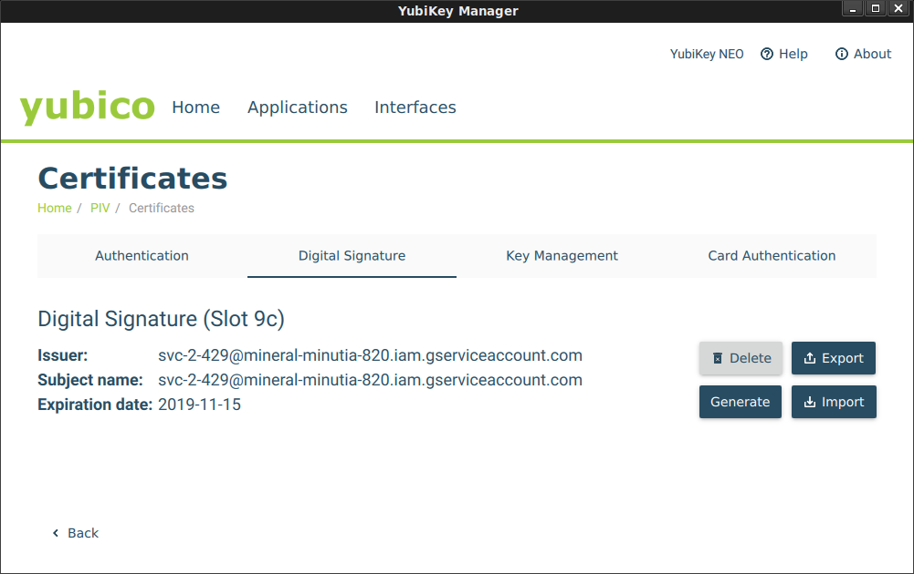

## YubiKeyTokenSource

Google Cloud Credentials source for Service Account keys embedded within a Yubikey PIV.

>> **WARNING:**  `YubiKeyTokenSource` is highly experimental.  This repo is NOT supported by Google

`google/oauth2/YubiKeyTokenSource` is a variation of `google/oauth2/JWTAccessTokenSourceFromJSON` where the private key used to sign the JWT is embedded within a [PIV-enabled YubiKey](https://developers.yubico.com/PIV/Introduction/YubiKey_and_PIV.html).

The private key in raw form _not_ exportable or exposed to the filesystem or any process other than through the Yubikey interface.  This token source uses the yubikey alone to `sign` the JWT which is then used to access a Google Cloud API.  

This library uses [go-ykpiv](https://github.com/paultag/go-ykpiv) which inturn uses C extensions to access the Yubikek provided by `libkpiv-dev`.  You must have `libkpiv-dev` the target system where this TokenSource will be used.

This repo is under Apache License but specifically this component is MIT License per [go-ykpiv](https://github.com/paultag/go-ykpiv/blob/master/LICENSE).

### Usage

1. Prepare Yubikey for Key import

	First embed a GCP Service Account file as a combined `x509` certificate within a YubiKey.

	You must have a [YubiKey Neo or YubiKey 4 or 5](https://developers.yubico.com/PIV/Introduction/YubiKey_and_PIV.html) as thoese keys support embedded keys.

	You are free to provision the key by any means but for reference, the following uses:

	* [yubico-piv-tool CLI](https://developers.yubico.com/yubico-piv-tool/)
	* [yubikey-manager-qt UI](https://developers.yubico.com/yubikey-manager-qt/development.html)


	On any other system, install supporting libraries for both components listed above.  

	Check Yubikey is plugged in
	
	```bash
	$ lsusb  | grep -i yubikey
	Bus 001 Device 013: ID 1050:0111 Yubico.com Yubikey NEO(-N) OTP+CCID
	```

	Launch the `ykman-gui` UI Application, it should also show the type of key you are using.  We will use `ykman-gui` later to import the keys.

2. Extract Service account certificate file

	Download a GCP [Service Account](https://cloud.google.com/iam/docs/service-accounts) **in .p12 format".

	Remove default passphrase (`notasecret`), generate an `x509` file for importing into the YubiKey.
	```
	openssl pkcs12 -in svc_account.p12  -nocerts -nodes -passin pass:notasecret | openssl rsa -out privkey.pem
	openssl rsa -in privkey.pem -outform PEM -pubout -out public.pem
	openssl req -new -x509  -key privkey.pem  -out public.crt
    		 Use CN=<your_service_account_email>
	openssl pkcs12 --export -in public.crt -inkey privkey.pem -outform PEM -out cert.pfx
	```

3. Embed Service Account within YubiKey

   Launch `yubikey-manager-qt` and navigate to the `Digital Signature` (9c). (see [Certificate Slots](https://developers.yubico.com/PIV/Introduction/Certificate_slots.html))
   Import the certificate `cert.pfx`.  If this is a new Yubikey, just use the default PIN and Management Keys provided. 

   You should see a loaded certificate:

   

   You can verify certificate load Status by running the `yubico-piv-tool`:

	```bash
	$ yubico-piv-tool -a status
	Version:	1.0.4
	Serial Number:	-1879017761
	CHUID:	3019d4e739da739ced39ce739d836858210842108421c84210c3eb34109acae3dbacb7f8b5295a1be28d916b2c350832303330303130313e00fe00
	CCC:	No data available
	Slot 9c:	
		Algorithm:	RSA2048
		Subject DN:	C=AU, ST=Some-State, O=Internet Widgits Pty Ltd, CN=svc-2-429@project.iam.gserviceaccount.com
		Issuer DN:	C=AU, ST=Some-State, O=Internet Widgits Pty Ltd, CN=svc-2-429@project.iam.gserviceaccount.com
		Fingerprint:	5726b54b6b50d737307a9ec09c0fc857258e23e7c05acf3f4d28cb3a2f37056b
		Not Before:	Oct 16 05:09:20 2019 GMT
		Not After:	Nov 15 05:09:20 2019 GMT
	PIN tries left:	3
	```

	And also verify sign/verify steps:
	```bash
	$ yubico-piv-tool -a read-certificate -s 9c
	-----BEGIN CERTIFICATE-----
	...
	-----END CERTIFICATE-----

	$ yubico-piv-tool -a verify-pin -a test-signature -s 9c
	Enter PIN: 
	Successfully verified PIN.
	Please paste the certificate to verify against...
	-----BEGIN CERTIFICATE-----
	...
	-----END CERTIFICATE-----
	Successful RSA verification.
	```

4. Install `libkpiv-dev` on target system

	On any system you wish to use this library, you must first install `libkpiv-dev`:

	Requires the latest `libykpiv-dev: 1.5.0+`  [issue#16](https://github.com/paultag/go-ykpiv/issues/16). 
	
	* [Ubuntu install](https://support.yubico.com/support/solutions/articles/15000010964-enabling-the-yubico-ppa-on-ubuntu)) 
	```bash
	sudo add-apt-repository ppa:yubico/stable && sudo apt-get update

    sudo apt-get install libykpiv-dev
	```

	* [Debian Install](https://packages.debian.org/search?keywords=yubico-piv-tool).  Its currently only on [debian sid](https://packages.debian.org/sid/libykpiv-dev)

	Insert the YubiKey and verify its detected:

	```bash
	$ lsusb  | grep -i yubikey
	Bus 001 Device 013: ID 1050:0111 Yubico.com Yubikey NEO(-N) OTP+CCID
	```

5. Use TokenSource


	After the key is embedded into the yubikey, you can *DELETE* any reference to `private.pem` or the `.p12` file (the private key now exists protected by the physical access to the yubikey).

	The YubiKey based `TokenSource` can now be used to access a GCP resource using either a plain HTTPClient or _native_ GCP library (`google-cloud-pubsub`)!!


	```golang
	package main

	import (
		"log"
		"net/http"
		"cloud.google.com/go/pubsub"

		"golang.org/x/oauth2"
		sal "github.com/salrashid123/yubikey/google"

		"google.golang.org/api/iterator"
		"google.golang.org/api/option"
	)

	func main() {
		yubiKeyTokenSource, err := sal.YubiKeyTokenSource(
			&sal.YubiKeyTokenConfig{
				Email:    "svcAccount@project.iam.gserviceaccount.com",
				Audience: "https://pubsub.googleapis.com/google.pubsub.v1.Publisher",
				Pin:      "123456",
			},
		)

		// tok, err := yubiKeyTokenSource.Token()
		// if err != nil {
		// 	 log.Fatal(err)
		// }
		// log.Printf("Token: %v", tok.AccessToken)
		client := &http.Client{
			Transport: &oauth2.Transport{
				Source: yubiKeyTokenSource,
			},
		}

		url := "https://pubsub.googleapis.com/v1/projects/YOURPROJECT/topics"
		resp, err := client.Get(url)
		if err != nil {
			log.Fatalf("Unable to get Topics %v", err)
		}
		log.Printf("Response: %v", resp.Status)


		// Using google-cloud library

		ctx := context.Background()
		pubsubClient, err := pubsub.NewClient(ctx, proj, option.WithTokenSource(yubiKeyTokenSource))
		if err != nil {
			log.Fatalf("Could not create pubsub Client: %v", err)
		}

		it := pubsubClient.Topics(ctx)
		for {
			topic, err := it.Next()
			if err == iterator.Done {
				break
			}
			if err != nil {
				log.Fatalf("Unable to iterate topics %v", err)
			}
			log.Printf("Topic: %s", topic.ID())
		}

	```

	Note:  by default the Yubikey allows for 3 PIN attempts before going into lockout.  To unlock, see  [PIN and Management Key](https://developers.yubico.com/yubikey-piv-manager/PIN_and_Management_Key.html)


	If you do not have the Yubikey Plugged in, you may see an error like this

	```bash
	error: SCardListReaders failed, rc=8010002e
	2019/10/16 07:33:10 Unable to open yubikey ykpiv ykpiv_connect: PKCS Error (-2) - Error in PCSC call
	```

Some notes:

  - Slot 9c: Digital Signature is reserved for Digital Signatures)
  - The default PIN for access is `123456`.  The default unlock code is `12345678`. 

See previous article about using the Yubikey NEO with GPG decryption [Encrypting Google Application Default and gcloud credentials with GPG SmardCard](https://medium.com/google-cloud/encrypting-google-application-default-and-gcloud-credentials-with-gpg-smardcard-fb6fec5c6e48).
The distinction here is that the RSA signing happens all onboard.